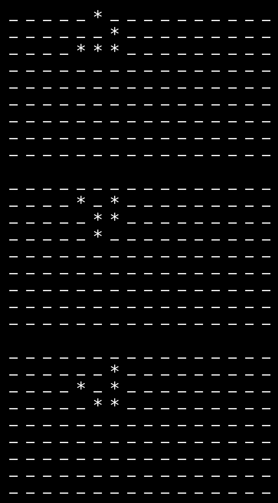

# GOL
Game of Life implemented in Node.js

## Usage
```javascript
let g1 = [
    [0,0,0,0,0,1,0,0,0,0,0,0,0,0,0,0],
    [0,0,0,0,0,0,1,0,0,0,0,0,0,0,0,0],
    [0,0,0,0,1,1,1,0,0,0,0,0,0,0,0,0],
    [0,0,0,0,0,0,0,0,0,0,0,0,0,0,0,0],
    [0,0,0,0,0,0,0,0,0,0,0,0,0,0,0,0],
    [0,0,0,0,0,0,0,0,0,0,0,0,0,0,0,0],
    [0,0,0,0,0,0,0,0,0,0,0,0,0,0,0,0],
    [0,0,0,0,0,0,0,0,0,0,0,0,0,0,0,0],
    [0,0,0,0,0,0,0,0,0,0,0,0,0,0,0,0]
];

// Glider
for(let i = 0;i < 20;i++)
{
    console.log(printGrid(g1));
    g1 = iterate(g1);
}
```

## Screenshots
<table>
<tr>
  <td><h4>Blinker</h4></td>
  <td><h4>Beacon</h4></td>
  <td><h4>Toad</h4></td>
  <td><h4>Glider</h4></td>
</tr>
</table>
